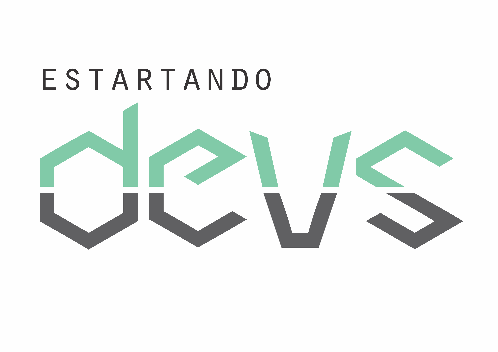

<p align="center">
  
  <h2 align="center"></h2>
</p>

<hr>

<div align="center">
  
  
  
  
  [](https://app.netlify.com/sites/site-devs/deploys)

</div>

## 🛠️ Como rodar o projeto?

1. Faça clone do repositório

```bash
git clone https://github.com/estartando-devs/site.git
```

2. Navegue até o diretório

```bash
cd site
```

3. Instale as dependencias

```bash
yarn install
```

4. Rode o app

```bash
yarn start
```

## 💻 Construído com:

<p align="left">
  <a href="https://reactjs.org/" target="_blank">  </a>
  <a href="https://www.typescriptlang.org/" target="_blank">  </a>
  <a href="https://redux.js.org" target="_blank">  </a>
  <a href="https://firebase.google.com/" target="_blank">  </a>
  <a href="https://firebase.google.com/" target="_blank">  </a> 
</p>


<hr>

<p align="center">
  :copyright: Estartando Devs :green_book:
</p>

